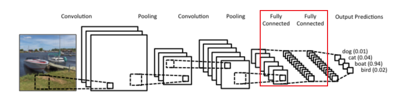
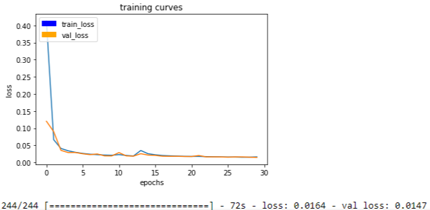

## Project "Follow Me" by Ian Logan


### The Network Architecture

For this project, the goal was to have a drone identify and follow a target in simulation. I used a fully convolutional network (FCN) with Keras layers in TensorFlow in order to accomplish the task. 

#### Traditional Convolutional Network vs Fully Convolutional Network

In general, convolutional neural networks (CNNs) are great for image classification. Using filters or "kernels," the network breaks down the image into smaller and smaller pieces to pull out meaningful and increasingly complex features, while simultaneously reducing spatial complexity of the image. While extremely useful from a purely image classifying standpoint, this would be an ineffective method for following a target in simulation. The question here is not simply, "Is the target in the image?" but rather, "Where in the image is the target?" The solution lies in *preserving* spatial information along with correctly classifying the target from the drones camera.

This is where CNN and FCN architecture diverges, and the benefits of a FCN for this project's purpose start to shine. After breaking down the image into very deep convolutions, CNNs use fully connected layers to assign weights and make predictions based on the extracted features from the convolution layers. This is great for classifying the image as a whole, but not classifying multiple objects within the image.



As stated earlier, this results in the loss of spatial information (i.e. the height and width of the image is lost), because in order for the output of the convolution to feed into the fully connected layer, it must be flattened into a two dimensional tensor first. For the purposes of this project, losing this spatial information would be detrimental, as it would make it impossible to locate where the target in the image is. We would only know that it exists somewhere in front of the camera. 

On the other hand, FCNs classify and retain spatial information by abandoning the fully connected model in order to use convolutions for every step in its architecture. It is this fully convolutional model that allows the drone to not only identify but also locate and follow the target through what is called semantic segmentation. Since the spatial information is retained, the network has the ability to assign meaning to multiple objects within an image.


I will go more in depth as to how the model accomplishes this in the following section, by using my own model as an example.

#### My Fully Convolutional Network


This model is a FCN that consists of four main parts: the encoder blocks, a 1x1 convolutional layer, decoding blocks, and skip connections. The reasoning for creating this model 

##### Encoder Blocks

Let's start by examining what makes up the encoder block. The encoder's job is no different than the convolutional layers' task in a traditional CNN; it seeks to break down an image and extract its features. As a result, we can follow the same general guidelines for constructing the encoder:

```python
def encoder_block(input_layer, filters, strides):

     # TODO Create a separable convolution layer using the separable_conv2d_batchnorm() function
	output_layer = separable_conv2d_batchnorm(input_layer, filters, strides)

	return output_layer
```

Important to note is that ```encoder_block()``` uses a function ```separable_conv2d_batchnorm()``` to construct it's convolutions. ```separable_conv2d_batchnorm()``` performs two steps: it takes an input and applies a separable convolution (as opposed to a regular one) to it, and it also applies batch normalization to that convolution. Separable convolutions seek to reduce the number of parameters produced by running a filter over each input channel separately before running additional 1x1 convolutions equal to the number of filters over those channels. Batch normalization allows the network to normalize the inputs at every layer, which equalizes variance and reduces the complexity of numerical computations for the network. Both of these steps together lead to an increase in runtime performance and reduction to training times.

```python
def separable_conv2d_batchnorm(input_layer, filters, strides=1):
    output_layer = SeparableConv2DKeras(filters=filters,kernel_size=3, strides=strides,
                             padding='same', activation='relu')(input_layer)

    output_layer = layers.BatchNormalization()(output_layer) 
    return output_layer
```


##### 1x1 Convolution Layer

Earlier, I mentioned the use of 1x1 convolutions in separable convolutions. 1x1 convolutions can be used to increase or decrease the dimensionality of a layer, while preserving spatial information, unlike fully-connected layers in traditional CNNs. This also makes it possible for FCNs to accept images of various sizes. The reasoning for this is that 1x1 convolutions retain their four-dimensional shape as opposed to being flattened to two-dimensions as they are with fully connected layers. To create them, all we have to do is set kernel size and stride to 1, and retain 'same' padding. I use the following function later in order to create this layer in my  model:


```python
def conv2d_batchnorm(input_layer, filters, kernel_size=3, strides=1):
    output_layer = layers.Conv2D(filters=filters, kernel_size=kernel_size, strides=strides, 
                      padding='same', activation='relu')(input_layer)

    output_layer = layers.BatchNormalization()(output_layer) 
    return output_layer
```


##### Decoder Blocks and Skip Connections

The decoder's purpose is to upscale the output of the encoder so that it is the same size as the original image. The main benefit of this is that, afterwards, each individual pixel in the original image has a prediction associated with it, which is especially useful for semantic segmentation.

To make semantic segmentation even more precise, we use skip connections. As images are broken down through the encoding layers, the network can lose track of the bigger picture. Skip connections connect layers from the encoder to the decoder so that the the network retains information from multiple resolutions.

FCN-8 vs FCN-32:


And here is the code where we put the above theory into practice:

```python
def decoder_block(small_ip_layer, large_ip_layer, filters):

	# TODO Upsample the small input layer using the bilinear_upsample() function.
	bip_layer = bilinear_upsample(small_ip_layer)

    # TODO Concatenate the upsampled and large input layers using layers.concatenate
    input_layer = layers.concatenate([bip_layer, large_ip_layer])

    # TODO Add some number of separable convolution layers
    output_layer = separable_conv2d_batchnorm(input_layer, filters)

    return output_layer
```

The decoder takes in the previous layers output as input and performs bilinear upsampling on them in order to scale up the image after features have been extracted through the encoder. Bilinear upsampling is an operation that attempts to fill in pixel values through interpolation. As a result, the image loses some detail, but the tradeoff is a boost in performance.

```python
def bilinear_upsample(input_layer):
    output_layer = BilinearUpSampling2D((2,2))(input_layer)
    return output_layer
```

Skip connections are created by concatenating the upsampled layer with an encoding layer. Again this assists with creating much more precise segmentation in the final output.

Finally, this layer is fed through a separable convolution with batch normalization.

##### Piecing the Model Together

```python
def fcn_model(inputs, num_classes):

    # TODO Add Encoder Blocks. 
    # As number of encoders increase, depth of model (number of filters) increases
    e1 = encoder_block(inputs, 32, 2) 
    e2 = encoder_block(e1, 64, 2) 
    e3 = encoder_block(e2, 128, 2) 

    # TODO Add 1x1 Convolution layer using conv2d_batchnorm().
    c1 = conv2d_batchnorm(e3, 256, 1) 

    # TODO: Add the same number of Decoder Blocks as the number of Encoder Blocks
    d1 = decoder_block(c1, e2, 128) 
    d2 = decoder_block(d1, e1, 64) 
    x  = decoder_block(d2, inputs, 32) 

    # The function returns the output layer of your model. "x" is the final layer obtained from the last decoder_block()
    return layers.Conv2D(num_classes, 1, activation='softmax', padding='same')(x)
```

The final model consists of 3 encoder blocks, a 1x1 convolutional layer, and 3 decoder blocks. I kept the default filter size of 3 (as defined in the original helper functions), but opted to use a stride of 2 for the encoding layers. This ensured that the image's spatial dimensions were cut in half at each layer. Meanwhile, depth was doubled to capture a wid e variety of features before passing to the 1x1 convolutional layer. 

Again, the 1x1 convolution continued the trend of doubling the filter depth. The main change here was that it contains a regular convolutional layer and the stride was reduced to 1.

The decoder blocks use skip connections to connect to the second and first encoder block before being connected to the input. This time, filter depth was halved before reclaiming its 3 color channel output shape.

### Hyperparameters

```python
# First Pass (30 Epochs)
learning_rate = 0.001
batch_size = 32
num_epochs = 30

# Second and Third Pass (10 Epochs each)
learning_rate = 0.0001
batch_size = 64
num_epochs = 10

# All Passes
steps_per_epoch = train_files // batch_size
validation_steps = valid_files // batch_size
workers = 4
```

As can be seen above, I trained the network for a total of 50 epochs, splitting up the training into 3 sections. First, I will go over the initial training pass and reasoning for choosing the hyperparameters. 

#### First Pass

The majority of this stage was spent tuning parameters, and it is where the bulk of training was done. As such, there was a fair amount of trial and error with this stage as opposed to the second and third passes.



##### Learning Rate

Choosing a proper learning rate was essential for the network to train properly. I started by testing how different weights effected the network. By selecting a higher rate of .01, I found the network converged too quickly, which left the validation loss too high. On the other hand, going with a rate of .0001 kept the network learning (while lowering validation loss), but at an extremely slow pace that kept training time too high. I opted with .001, because I found training time was kept shorter, while still lowering training and validation loss at an acceptable rate.

##### Batch Size

I used similar reasoning with batch size as I did learning rate. I wanted fast, effective training, where I could refine learning in the later passes. Because of this, I opted for a batch size of 32. Too high and I ran the risk of running into a minima (trapping validation loss), and too low would keep the validation curve bouncing  erratically, while training loss improved. A batch size of 32 kept both training and validation loss on a smooth decline.

##### Epochs

With learning rate and batch size determined, the number of epochs to choose was straightforward. I allowed the network to run until validation loss stopped improving, which happened at 30 epochs.

##### Steps Per Epoch & Validation Steps

Note the variables `train_files` and `valid_files`. These are the number of images in each training and validation set, respectively. I divided the sets by the number of batches so there would be an even number of images in each batch.

##### Workers

Workers is dependent on hardware capabilities. I didn't find any improvement in training times after setting it to 4 on my machine, so I didn't increase it any more.

##### Result


After the 30 epochs were complete, the network achieved an accuracy of 43.9%! I opted to continue training using a second and third pass to see if I could get better results.


#### Second and Third Pass

This section will be more brief as the logic for hyperparameter tuning is explained above.

##### Learning Rate and Batch Size

Since the majority of training was finished I reverted to the slower, yet still effective learning rate of .0001. 

For the same reasoning, I doubled the batch size to 64 in hopes of achieving a smoother decline in validation loss. Originally, it had bounced between .016 and .014, so it did localize validation bouncing to values .0138 through .0145. With that said, it did not decline much unlike training loss.

##### Epochs

Since I did not want the model to overfit, I pushed the network in small increments to see how its accuracy improved. I found 10 to be a small, yet effective number in achieving this.

##### Results

Here was the score after 40 epochs: 


The model improved by 1% so I decided to push it further. In doing so there was not much more improvement. After 50 epochs the validation loss was not improving:


Although the score did marginally:


Being that the training loss was decreasing while validation loss remained largely unchanged, I stopped training so that the model would not overfit and start losing accuracy. Overall the results turned out really well. Upon running the model in simulation, the drone was able to identify the target and follow them around the environment.

### Future Enhancements

As it stands, the project was a success. With that said, there is always room for improvement. 

The most immediate improvement I plan to make would be automatically checkpointing the model during training when the validation loss decreases (I didn't because for the sake of the project, certain cells in the jupyter notebook weren't to be modified). By doing so, I could experiment with different epochs more, without worrying as much about overfitting the model.

The decoder is also a bit heavy on skip connections. `decoder_block` is currently built to have a skip connection at every layer, but this is not a necessity (see FCN-8 above). I would experiment with creating a deeper network with fewer skip connections moving forward.

I would also like to test the benefit of using higher resolution images. For the sake of training, I added in thousands more images of the target (and non-targets) walking at a distance to help the drone identify when the target was far away. 


I noticed that adding in more images of far away objects introduced an over-segmentation of the scene, despite an increase in overall accuracy. In other words, the network was seeing people where there weren't any. I hypothesize that it has to do with the network's increased exposure to small, low-resolution objects during training. Even as a human being, I had trouble identifying some of the smudges of pixels that turned out to be people. In the future, I would like to train on higher resolution images to see how that would effect semantic segmentation and overall accuracy of the drone.

And finally, another improvement I would like to see is expanding the number of models used in the Unity simulation, and the drones ability to follow them. FCNs are great for classifying multiple objects within an image, and there is no reason why this model couldn't learn to follow another target (such as a car) in simulation. Since there were no cars in training, I would obviously need to gather more data with images of the cars in simulation, but the model itself should perform quite well!